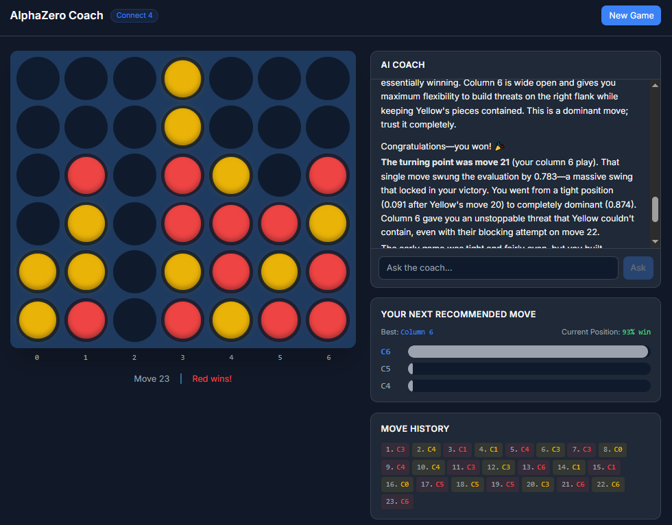

# AlphaZero Coach

AI-powered Connect 4 coaching platform. Play against a superhuman AlphaZero agent in the browser while an LLM coach analyzes positions in real time — powered by Monte Carlo Tree Search evaluation and a strategy knowledge base.



Built on top of [alphazero-boardgames](https://github.com/r9v/alphazero-boardgames), my from-scratch AlphaZero implementation with Cython-accelerated MCTS, PyTorch neural network, and bitboard game engine. The Connect 4 model was trained via self-play and defeated 2200 Elo bots.

## Features

- **Play against AlphaZero** — interactive Connect 4 board with animated piece drops
- **Live coaching** — after each move, an LLM agent evaluates the position via MCTS and streams natural-language analysis
- **MCTS analysis panel** — visual breakdown of recommended moves with win percentage
- **Conversational Q&A** — ask the coach anything: "Why is column 4 better than column 3?"
- **Strategy knowledge base (RAG)** — coach cites Connect 4 concepts (center control, odd/even theory, threats, tempo) from an indexed corpus via ChromaDB
- **Post-game review** — full game replay identifying the critical turning point

## Tech Stack

- **Backend:** Python, FastAPI, LangChain/LangGraph, ChromaDB, sentence-transformers
- **Frontend:** React, TypeScript, Vite, Tailwind CSS
- **Game engine:** [alphazero-boardgames](https://github.com/r9v/alphazero-boardgames) (PyTorch, Cython MCTS, bitboard engine)
- **LLM:** Google Gemini or Anthropic Claude (auto-detected from API key)

## How It Works

You play Connect 4 against a superhuman AI. After each move, a coaching agent calls into the MCTS engine to evaluate the position, searches a strategy knowledge base for relevant concepts, and streams real-time advice — explaining not just what to play, but why.

The coach is a LangGraph ReAct agent with 7 tools: position evaluation, move ranking, move comparison, game replay analysis, last-move grading, board state inspection, and strategy search. Each tool calls the real AlphaZero engine — no guessing.

## Quick Start

```bash
# With Docker
docker-compose up --build
# Open http://localhost:8000

# Or manually
pip install -r requirements.txt
cp .env.example .env              # add your GOOGLE_API_KEY or ANTHROPIC_API_KEY
uvicorn core.api.server:app       # backend
cd frontend && npm install && npm run dev  # frontend at http://localhost:5173
```

Requires [alphazero-boardgames](https://github.com/r9v/alphazero-boardgames) installed separately (`pip install -e .` in that repo).
