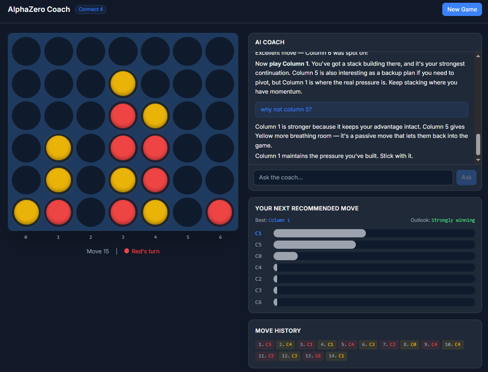

# AlphaZero Coach

AI-powered Connect 4 coaching platform. Play against a superhuman AlphaZero agent in the browser while an LLM coach analyzes positions in real time, powered by Monte Carlo Tree Search evaluation and a hybrid-retrieval strategy knowledge base.

Built on top of [alphazero-boardgames](https://github.com/r9v/alphazero-boardgames), my from-scratch AlphaZero implementation with Cython-accelerated MCTS, PyTorch neural network, and bitboard game engine. The Connect 4 model was trained via self-play and defeated 2200 Elo bots.

You can play it right now, **[click here for the live demo](https://alphazero-coach.xyz/)**.



## Features

- **Play against AlphaZero** — interactive Connect 4 board with animated piece drops
- **Live coaching** — after each move, a LangGraph ReAct agent evaluates the position via MCTS and streams natural-language analysis
- **MCTS analysis panel** — visual breakdown of recommended moves with win percentage
- **Conversational Q&A** — ask the coach anything: "Why is column 4 better than column 3?"
- **Hybrid RAG knowledge base** — dense + BM25 retrieval, RRF fusion, and cross-encoder reranking over a Connect 4 strategy corpus
- **Post-game review** — full game replay identifying the critical turning point

## Tech Stack

- **Backend:** Python, FastAPI, SSE-Starlette
- **LLM/Agent:** LangChain + LangGraph ReAct agent, Anthropic Claude or Google Gemini (auto-detected from API key)
- **Retrieval:** ChromaDB (dense) + rank-bm25 (sparse), sentence-transformers bi-encoder and cross-encoder
- **Game engine:** [alphazero-boardgames](https://github.com/r9v/alphazero-boardgames) (PyTorch, Cython MCTS, bitboard engine)
- **Interop:** MCP server exposing the engine + strategy tools over Model Context Protocol
- **Observability:** Langfuse, traces every LLM call, tool invocation, and agent step with session and user tracking
- **Frontend:** React, TypeScript, Vite, Tailwind CSS

## How It Works

You play Connect 4 against a superhuman AI. After each move, a coaching agent calls into the MCTS engine to evaluate the position, searches a strategy knowledge base for relevant concepts, and streams real-time advice, explaining not just what to play, but why.

The coach is a LangGraph ReAct agent with 7 tools: position evaluation, move ranking, move comparison, game replay analysis, last-move grading, board state inspection, and strategy search. Each tool calls the real AlphaZero engine, no guessing.

## Retrieval Pipeline

`search_strategy` is backed by a multi-stage retrieval stack (`core/agent/rag.py`), the kind used on production-scale corpora. Each stage is toggleable via `RetrievalConfig` / env vars:

1. **Dense retrieval** — sentence-transformers bi-encoder over ChromaDB.
2. **Sparse retrieval** — Okapi BM25 lexical scoring (`rank-bm25`).
3. **Fusion** — [Reciprocal Rank Fusion](https://plg.uwaterloo.ca/~gvcormac/cormacksigir09-rrf.pdf) merges the dense and sparse rankings without score calibration.
4. **Re-ranking** — a cross-encoder (`ms-marco-MiniLM`) re-scores the fused candidates for precision.
5. **Contextual chunks** — each chunk is prefixed with document/section context before indexing (a lightweight take on Anthropic's [contextual retrieval](https://www.anthropic.com/news/contextual-retrieval)).
6. **HyDE (optional)** — [Hypothetical Document Embeddings](https://arxiv.org/abs/2212.10496): the dense arm can embed an LLM-drafted hypothetical answer instead of the bare query (`RAG_HYDE=1`).

```
query ──► HyDE? ──► dense (Chroma) ─┐
                                     ├─► RRF fusion ──► cross-encoder rerank ──► top-k
query ───────────► BM25 (sparse) ───┘
```

For a corpus this small a flat semantic search is already sufficient. The full pipeline demonstrates the retrieval engineering rather than being load-bearing for eight documents, and it degrades gracefully (dense-only) when optional dependencies are absent.

## Evaluation

Retrieval quality is measured separately from generation quality, so a bad answer can be traced to the retriever or the generator rather than guessed at.

```bash
python -m core.eval.run            # retrieval metrics (no API key needed)
python -m core.eval.run --judge    # + LLM-as-judge on generated answers
```

- **Retrieval** (`core/eval/retrieval.py`) — hit@k, recall@k, MRR, and nDCG@k against a golden set of question → relevant-source labels (`data/eval/golden_qa.jsonl`).
- **Generation** (`core/eval/judge.py`) — an LLM judge scores faithfulness (grounded in retrieved context) and relevance, with bias mitigations (fixed rubric, context-only grounding, required rationale).

## MCP Server

The same MCTS and strategy-search tools are exposed over the Model Context Protocol, so any MCP client (Claude Desktop, an IDE agent, another orchestrator) can drive the engine directly.

```bash
python -m core.mcp.server
```

Tools: `new_game`, `play_move`, `evaluate_position`, `search_strategy`.

## Safety / Guardrails

The coach reads free-text player input, so `core/agent/guardrails.py` scans it for prompt-injection signatures (instruction-override, prompt-leak, role-injection) and hardens the system prompt when input looks suspicious. A `canary_check` helper supports the retrieval-security test pattern (assert permission-scoped retrieval never surfaces a tagged canary document) for use in CI. These are defense-in-depth; the coach's tools are read-only and cannot reach external systems.

## Quick Start

```bash
# With Docker
docker-compose up --build
# Open http://localhost:8000

# Or manually
pip install -r requirements.txt
cp .env.example .env              # add your GOOGLE_API_KEY or ANTHROPIC_API_KEY
uvicorn core.api.server:app       # backend
cd frontend && npm install && npm run dev  # frontend at http://localhost:5173
```

Common tasks are wrapped in the `Makefile` (`make serve`, `make test`, `make eval`, `make mcp`).

Requires [alphazero-boardgames](https://github.com/r9v/alphazero-boardgames) installed separately (`pip install -e .` in that repo).
